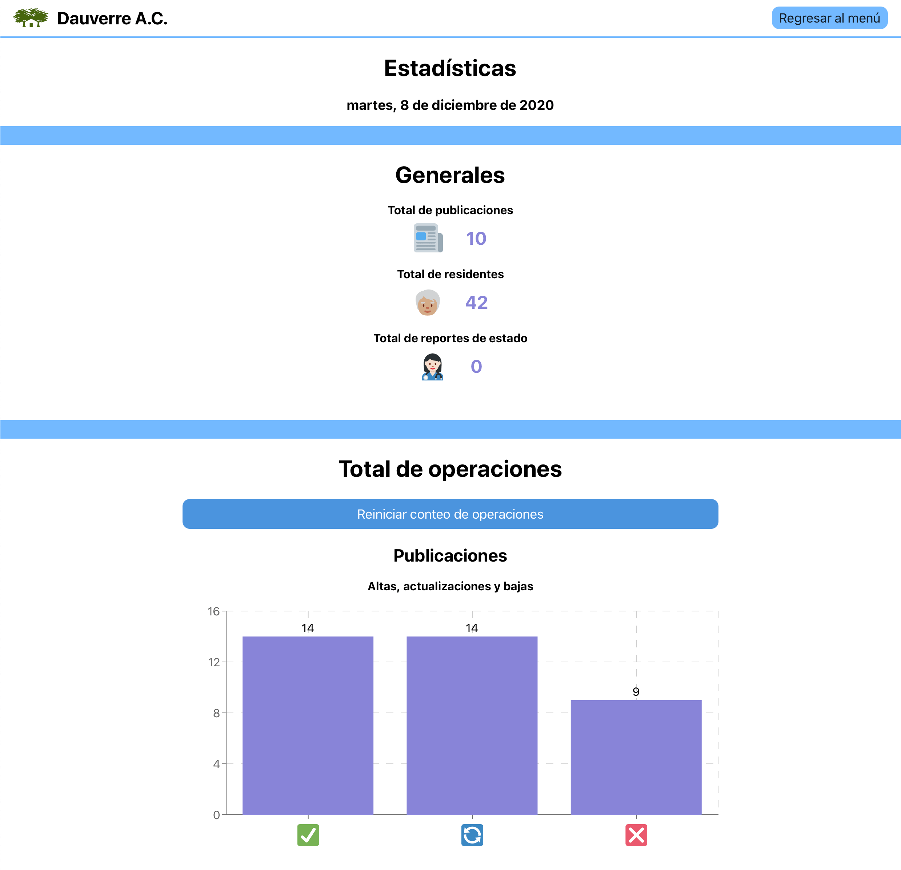

# Dauverre Web

Webpage and Web application for Dauverre A.C. (foster home for elders).

Built with:

---

### Front Page

  

### Login Page

  

### Menu Page

  

### Posts Page

  

### Posts Form Page

  

### Residents Page

  

### Residents Form Page

  

### Access Module Page

  

### Stats Page

  

### Change password Page

  

